# FDA-CRL-ANALYSIS - Currently in Progress
FDA CRL Public Safety Risk Index — Ingests FDA Complete Response Letters via the openFDA API, applies an AI-assisted scoring rubric across deficiency severity, drug type, facility inspection, and outcome severity, and visualizes aggregated facility-level public safety risk scores on an interactive geographic map.

#### About the Public Safety Risk Score
This tool visualizes a proprietary Public Safety Risk Score derived from FDA Complete Response Letters (CRLs) — official correspondence issued when the FDA determines a drug or biologic application cannot be approved in its current form. Each letter was analyzed using an AI-assisted rubric designed to quantify the potential public safety impact of the deficiencies cited.
How the Score is Calculated
Each CRL is evaluated across four dimensions:

.svg)

####  Deficiency Severity 
— Measures the seriousness of the cited manufacturing, safety, or efficacy deficiencies. This score is weighted by a Drug Type Multiplier, which reflects the relative risk profile of the drug category. Together, these produce a Deficiency Severity Score ranging from 0 (no concern) to -50 (critical concern).
#### Facility Inspection 
— Reflects the findings and resolution status of any facility inspections cited in the letter, contributing up to -25 points.
#### Outcome Severity 
— Captures the potential patient harm associated with the deficiencies identified, contributing up to -25 points.

#### Roll-up Logic
These three components are summed and subtracted from a baseline of 100, yielding a per-letter score ranging from 0 to 100, where a higher score indicates lower public safety risk and a higher score indicates greater concern.
Where a facility has received multiple CRLs, scores are averaged across all letters. For each additional letter beyond the first, the aggregated "Roll-Up" score is penalized by 10 points, reflecting the elevated risk associated with repeat regulatory action. The Roll-Up score is floor-capped at 0.
Interpreting the Score
Score RangeInterpretation91 – 100Minimal public safety concern71 – 90Low public safety concern51 – 70Moderate public safety concern36 – 50Elevated public safety concern16 – 35High public safety concern0 – 15Critical public safety concern
Limitations
This score is derived from AI-assisted analysis of redacted CRL text and should be interpreted with the following caveats in mind. The underlying CRL dataset is a growing but incomplete archive — not all CRLs issued by the FDA are currently published. Redactions in source letters may obscure the full scope of cited deficiencies. The rubric reflects a structured but interpretive framework; scores represent an assessed risk signal, not an official FDA determination.

## ETL Pipeline

This project includes a fully automated, cloud-native ETL pipeline that monitors the FDA's Complete Response Letter (CRL) database and incrementally updates a set of Databricks Delta tables with AI-generated risk scores on a monthly basis.

### Overview

The pipeline detects net-new FDA enforcement letters, evaluates them against a proprietary public safety scoring rubric using Claude (Anthropic), and persists the results to Databricks — all without manual intervention. It is containerized with Docker, deployed to AWS ECS Fargate, and triggered monthly via EventBridge.

### Pipeline Architecture

**1. Incremental Extract**
Pulls the full CRL dataset from the FDA Transparency API and performs a set difference against existing records in Databricks to identify only net-new letters. This ensures idempotent, non-duplicative loads regardless of how many times the pipeline runs.

**2. Geocoding**
New company addresses are geocoded via the Google Maps API and stored in a locations reference table. The pipeline checks against existing geocoded records to avoid redundant API calls.

**3. AI-Powered Scoring**
New letters are batched in groups of 10 and evaluated by Claude Haiku against a structured public safety rubric spanning four dimensions: Deficiency Severity, Drug Type Multiplier, Facility Inspection Status, and Outcome Severity. The model returns structured JSON scores with source citations pulled directly from the letter text, enabling auditability of every scoring decision.

**4. Score Transformation**
Raw categorical scores returned by the model are mapped to numeric values via reference tables and combined into a composite public safety risk score per letter using a weighted formula.

**5. Company-Level Rollup**
Individual letter scores are aggregated to the company-address level, with a repeat offense detractor applied to penalize companies with multiple CRLs. The resulting table powers the front-end visualization layer and is fully replaced on each run to reflect the latest state of all scores.

### Tables

| Table | Layer | Operation |
|-------|-------|-----------|
| `fda_risk.raw.letters` | Raw | Incremental append |
| `fda_risk.transformed.locations_ref` | Transformed | Incremental append |
| `fda_risk.transformed.individual_public_safety_risk_scores` | Transformed | Incremental append |
| `fda_risk.transformed.rolled_up_public_safety_risk_scores` | Transformed | Full replace |

### Infrastructure

| Component | Technology |
|-----------|------------|
| Compute | AWS ECS Fargate |
| Container Registry | AWS ECR |
| Scheduler | AWS EventBridge `cron(0 8 1 * ? *)` |
| Secrets Management | AWS Secrets Manager |
| Data Warehouse | Databricks (Delta Lake) |
| AI Scoring | Anthropic Claude Haiku |
| Geocoding | Google Maps API |
